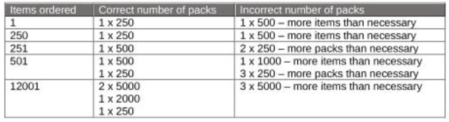

# `packs`

## **project `summary`**

This application calculates the correct number of packs needed to ship to the customer based on the specified pack sizes (250, 500, 1000, 2000, 5000 items) and pack rules. It ensures that only whole packs are sent, no more items than necessary are dispatched, and the fewest possible packs are used to fulfill each order.

### **packs `setup`:**

To use the application, submit an order through the HTTP API endpoint specifying the number of items. The application will return the calculated number of packs needed to fulfill the order according to the specified rules.

### **packs `how to..`:**

The application is implemented in Golang and provides an HTTP API for receiving orders. The core logic for calculating the number of packs is encapsulated in functions within `main.go`, ensuring adherence to the specified rules. Unit tests in `main_test.go` verify the accuracy of the pack calculation logic.

### **packs `output examples:`**

 

### **`tech` stack**

&nbsp;&nbsp;&nbsp;

  

### **next `steps`**

- keep app flexibility so that pack sizes can be amended without changing the production code
- create a UI to interact with the API
